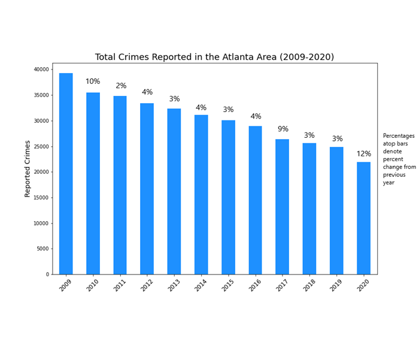
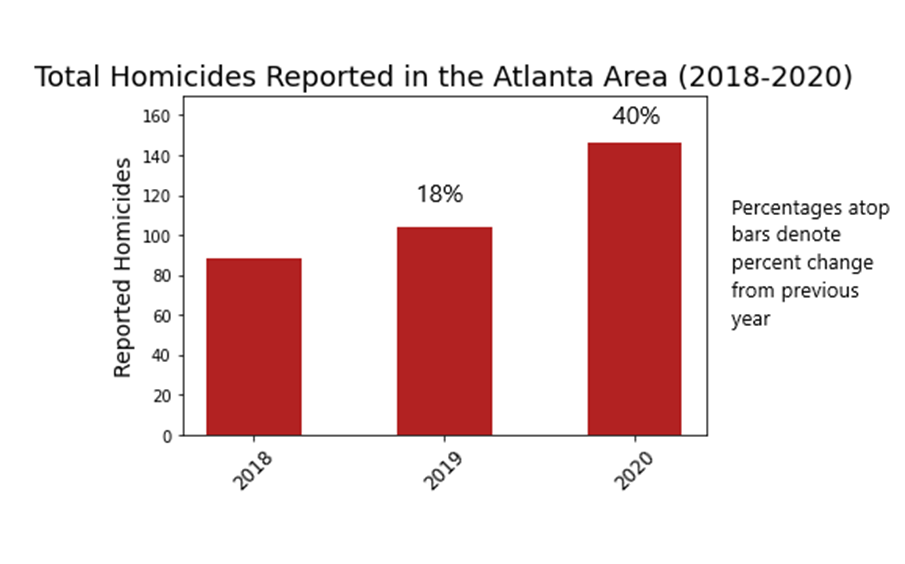
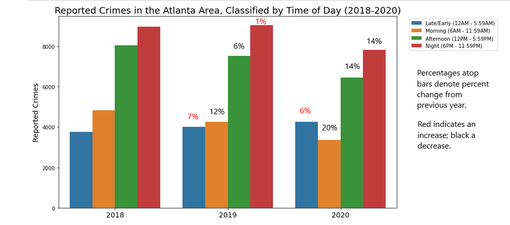
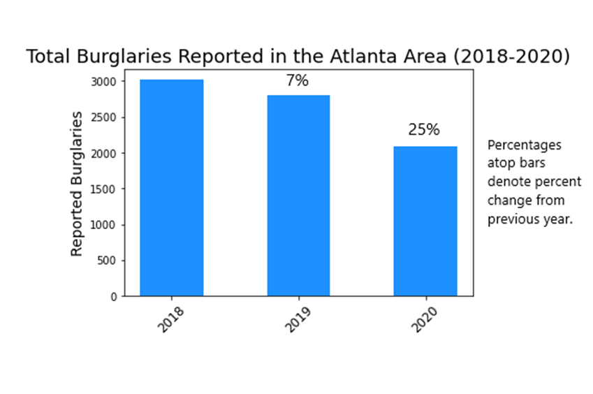
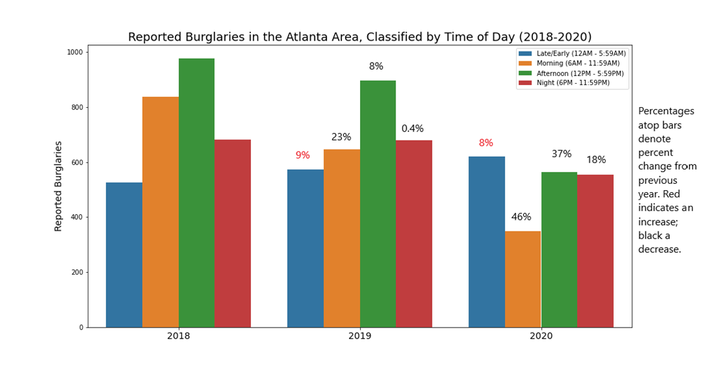

The aim of this collaborative project was to analyze crime data from Atlanta, look for trends and determine what effects (if any) the COVID-19 pandemic had on crime in the Atlanta area. Additionally, we sought to create a map with the top 10 neighborhoods labeled according to crime levels. Pandas in Jupyter notebook was used for the analysis and the heatmap was created using the Google maps API.
Data was obtained from the Atlanta Police Department (https://www.atlantapd.org/) Raw Crime Data Download (2009-2020). 

An overall downward trend was seen in crime from 2009-2020.

 

However, an increase in violent crimes was seen in 2020, with a 40% increase in homicides from the previous year.

 

Breaking down crimes by the time of day, it was revealed that most crimes occur in the afternoon and night (12PM - 12AM). In 2020, less crime occurred during the times where many people may have usually been at work: morning, afternoon and night.

 

This lead to a further analysis of what types of crimes were occurring at these times of day. Not surprisingly, there were less burglaries occurring overall in 2020 and at the times of day where less crime was seen in 2020.

 

The top 10 neighborhoods with the most criminal activity were tagged with information about the neighborhoods available when clicking on the marker. The most criminal activity was seen in the Downtown and Midtown neighborhoods, respectively.

 

  

